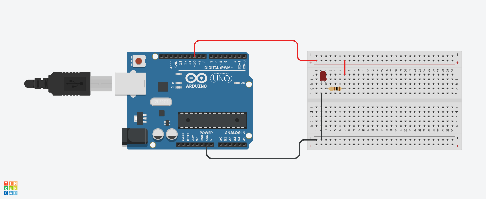

# LED Flasher

The objective of this project is to spell out the SOS code in Morse code using an LED.

## Project Components

- 1x Arduino UNO
- 1x Protoboard
- 1x 5mm LED
- 1x 100Ω resistor

## Project Sketch

This sketch was made using TinkerCAD software

  

