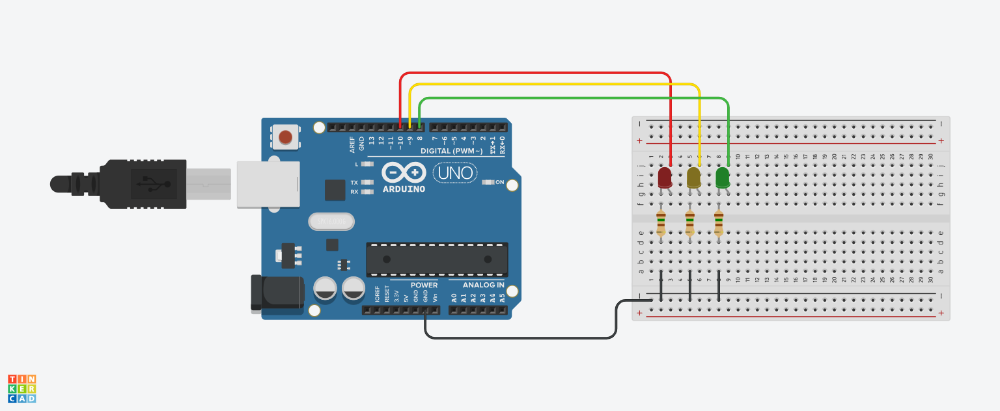

# Traffic Lights

The objective of this project is to make a traffic light.

## Project Components

- 1x Arduino UNO
- 1x Protoboard
- 1x red LED
- 1x green LED
- 1x yellow LED
- 3x 150Ω resistor

## Project Sketch

This sketch was made using TinkerCAD software

  

