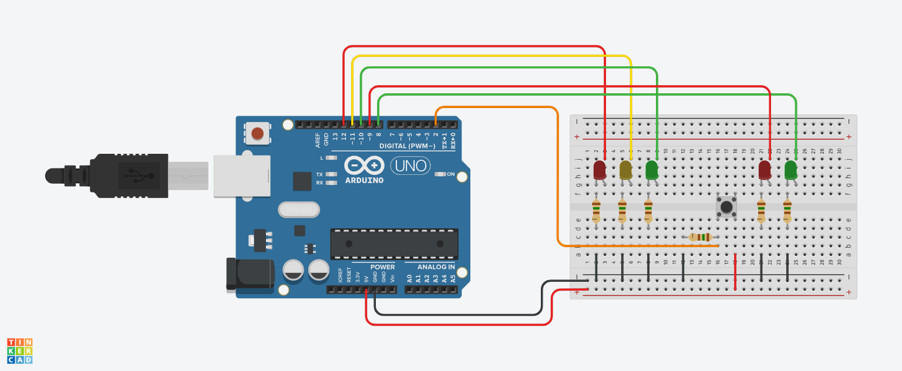

# Interactive Traffic Lights

The objective of this project is to make an interactive traffic light with a pedestrian beacon that is activated using a button.

## Project Components

- 1x Arduino UNO
- 1x Protoboard
- 2x red LED
- 2x green LED
- 1x yellow LED
- 5x 150Ω resistor
- 1x button

## Project Sketch

This sketch was made using TinkerCAD software

  

