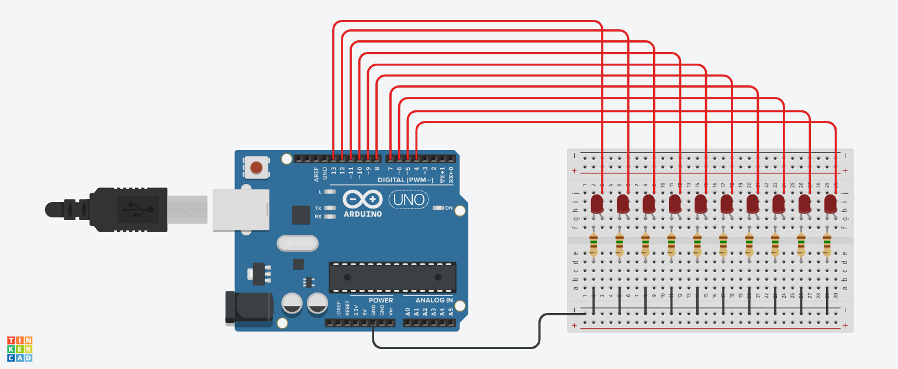

# LED Chase Effect

The objective of this project is to create a sequential lighting effect using LEDs.

## Project Components

- 1x Arduino UNO
- 1x Protoboard
- 10x 5mm LED
- 10x 150Ω resistor

## Project Sketch

This sketch was made using TinkerCAD software

  

